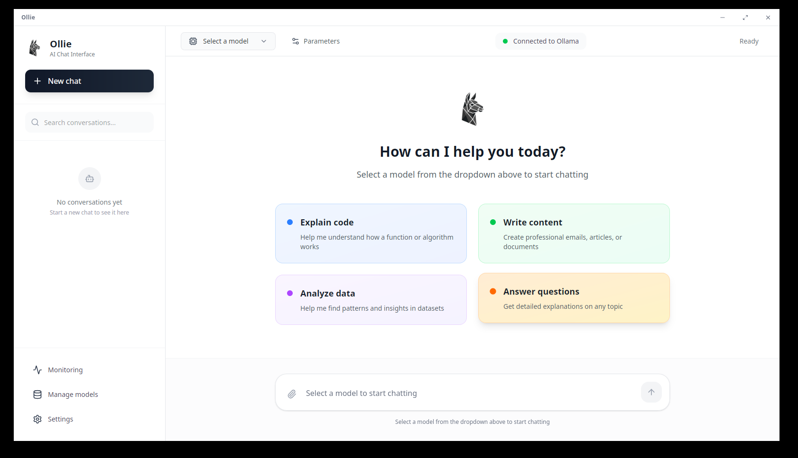
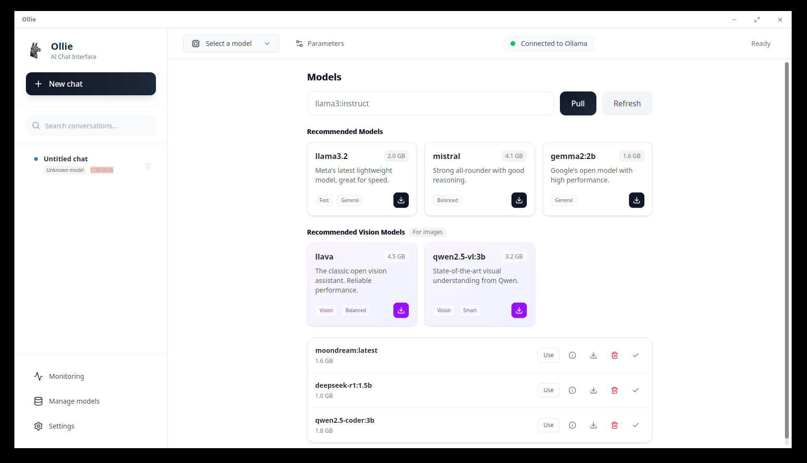
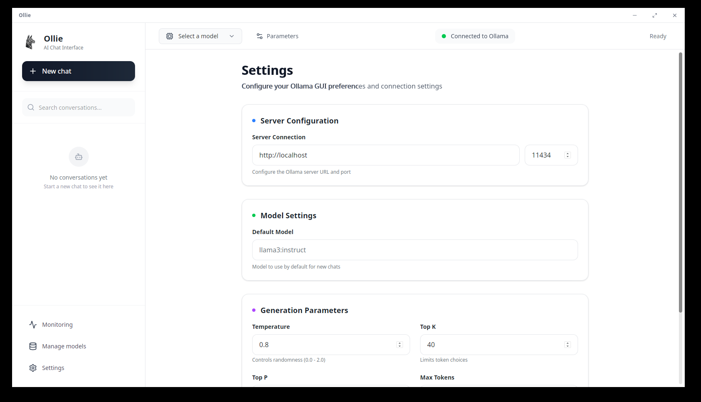
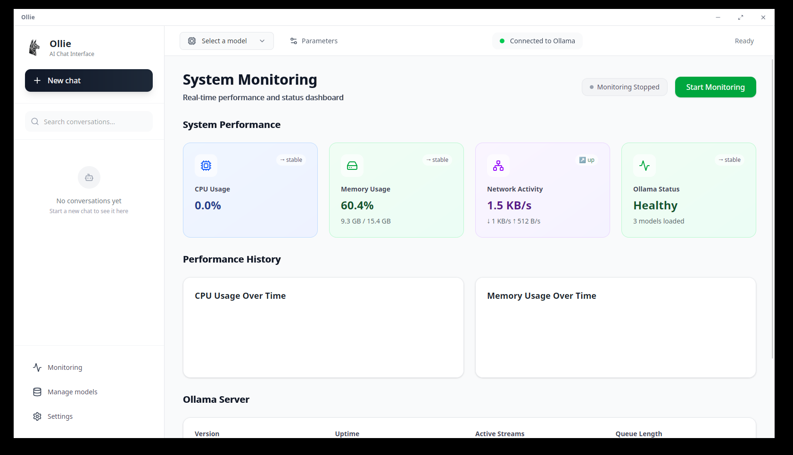

<p align="center">
  
</p>

# Ollie — Your Friendly Local AI Companion

**Ollie** (formerly OllamaGUI) is a personal AI assistant you run on your own Linux machine. It provides a polished, modern interface for chatting with local LLMs via Ollama—no CLI required.

If you want a personal, single-user assistant that feels premium, fast, and always-on, this is it.



## Install (Linux AppImage)

No configuration needed. Just download and run.

```bash
wget -O Ollie.AppImage https://github.com/MedGm/OllamaGUI/releases/latest/download/Ollie_*_amd64.AppImage
chmod +x Ollie.AppImage
./Ollie.AppImage
```

*Requirements: [Ollama](https://ollama.com) installed and running.*

## Highlights

**Local-First Experience**
Ollie runs entirely on your machine. Your chats, data, and models stay private. No cloud dependencies, no tracking.

**Modern Chat Interface**
A clean, distraction-free UI built with React and Tailwind. Supports full Markdown rendering, code highlighting, tables, and math equations.

**Model Management**
Pull, delete, and manage your Ollama models directly from the app. No need to drop to the terminal.

**Vision & File Analysis**
Drag and drop images to analyze them with vision models like LLaVA. Upload PDFs and text files to chat with your documents instantly.

**Monitoring Dashboard**
Real-time tracking of your system resources (CPU, Memory) and model performance while generating responses.

## Gallery

| Models | Settings |
|:---:|:---:|
|  |  |

| Monitoring | Vision |
|:---:|:---:|
|  |  |

## Tech Stack

- **Frontend**: React 19, TypeScript, Tailwind CSS v4
- **Backend**: Tauri v2 (Rust)
- **Database**: SQLite (local persistence)

## Data & Configuration

- **Local Database**: `~/.config/ollie/app.db`
- **Settings**: `~/.config/ollie/settings.json`

## Roadmap

- Mobile Companion App (iOS/Android)
- Cloud API Integration (Anthropic/OpenAI)
- Voice Mode
- Plugin System

## License

MIT License. Created by @MedGm.
